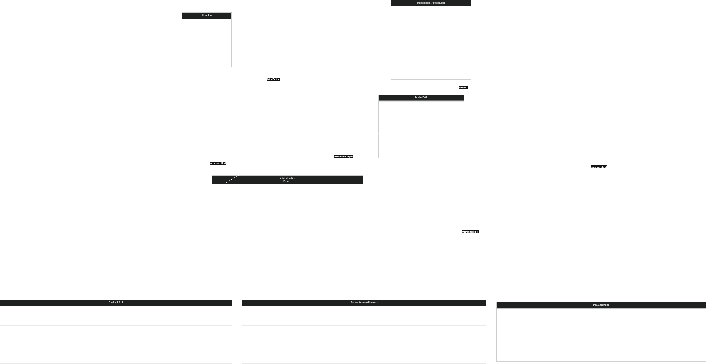

# Sistem Manajemen Layanan Medis & BPJS Rumah Sakit

Project ini dibuat untuk memenuhi tugas **Ujian Akhir Semester Praktikum Pemrograman Berorientasi Objek (PBO)**. Sistem ini menggunakan **PHP OOP murni** dan terhubung dengan database **MySQL** untuk menampilkan data pasien rawat inap serta menghitung biaya layanan berdasarkan jenis penjamin pasien.

Studi kasus yang digunakan adalah:

**Kasus B: Sistem Manajemen Layanan Medis & BPJS Rumah Sakit**

---

## Daftar Anggota Kelompok

| No | Nama Anggota |
|---|---|
| 1 | Ahmad Fakhri Abdullah |
| 2 | Astri Yuli Andani |
| 3 | Elang Panca Tunggal |
| 4 | Lutfi Mohammad Hafiz |
| 5 | Mukhamad Ferdiyanto |

---

## Deskripsi Singkat Sistem

Sistem ini digunakan untuk mengelola dan menampilkan data pasien rawat inap berdasarkan tiga jenis penjamin layanan, yaitu:

1. **Pasien BPJS**
2. **Pasien Asuransi Swasta**
3. **Pasien Umum / Mandiri**

Setiap jenis pasien memiliki aturan perhitungan biaya yang berbeda. Perbedaan perhitungan tersebut diterapkan menggunakan konsep **polymorphism** melalui method `hitungTotalBiaya()` yang dioverride pada setiap subclass.

---

## Teknologi yang Digunakan

- PHP
- MySQL
- phpMyAdmin
- HTML
- CSS
- GitHub

---

## Struktur Folder Project

```text
tugaskelompok-pbo/
│
├── config/
│   └── Koneksi.php
│
├── controllers/
│   └── ManajemenRumahSakit.php
│
├── dal/
│   └── PasienDAL.php
│
├── models/
│   ├── Pasien.php
│   ├── PasienBPJS.php
│   ├── PasienAsuransiSwasta.php
│   └── PasienUmum.php
│
├── class-diagram.png
├── rumah_sakit_pbo.sql
├── index.php
└── README.md
```

---

## Panduan Instalasi dan Menjalankan Aplikasi

### 1. Clone Repository

Clone repository dari GitHub menggunakan perintah berikut:

```bash
git clone link-repository-github-kelompok
```

Atau download repository dalam bentuk ZIP, lalu ekstrak folder project.

---

## 2. Pindahkan Folder Project ke Server Lokal


Pada project ini, Document Root Laragon sudah disesuaikan ke folder project, sehingga aplikasi dapat langsung dijalankan melalui:

```text
http://localhost/index.php
```

Jika Document Root Laragon masih menggunakan pengaturan default, folder project biasanya diletakkan di:

```text
C:/laragon/www/tugaskelompok-pbo
```

Kemudian aplikasi dijalankan melalui:

```text
http://localhost/tugaskelompok-pbo/index.php
```

Jika menggunakan **XAMPP**, letakkan folder project di:

```text
C:/xampp/htdocs/tugaskelompok-pbo
```

Kemudian jalankan melalui:

```text
http://localhost/tugaskelompok-pbo/index.php
```

---

### 3. Import Database

1. Buka **phpMyAdmin**.
2. Buat database baru dengan nama:

```text
rumah_sakit_pbo
```

3. Import file database:

```text
rumah_sakit_pbo.sql
```

4. Pastikan tabel berikut berhasil dibuat:

```text
pasien
pasien_bpjs
pasien_asuransi_swasta
pasien_umum
```

---

### 4. Konfigurasi Koneksi Database

Buka file:

```text
config/Koneksi.php
```

Pastikan konfigurasi database sudah sesuai:

```php
private $host = "localhost";
private $username = "root";
private $password = "";
private $database = "rumah_sakit_pbo";
```

Jika menggunakan Laragon atau XAMPP default, biasanya username adalah `root` dan password kosong.

---

### 5. Jalankan Aplikasi

Buka browser, lalu akses:

```text
http://localhost/index.php
```

Aplikasi akan menampilkan halaman utama berupa dashboard sistem rumah sakit.

---

## Fitur Aplikasi

Aplikasi memiliki beberapa halaman utama:

| Menu | Keterangan |
|---|---|
| Dashboard | Menampilkan ringkasan jumlah pasien dan total tagihan |
| Semua Pasien | Menampilkan seluruh data pasien |
| Pasien BPJS | Menampilkan data pasien dari model `PasienBPJS` |
| Pasien Asuransi | Menampilkan data pasien dari model `PasienAsuransiSwasta` |
| Pasien Umum | Menampilkan data pasien dari model `PasienUmum` |
| Laporan Klaim | Menampilkan laporan klaim layanan dan total biaya pasien |

---

## Class Diagram UML

Class Diagram UML menunjukkan hubungan antar class dalam sistem, termasuk inheritance, association, composition, atribut, dan method yang digunakan.

Gambar Class Diagram UML diletakkan pada folder:

```text
assets/class-diagram.png
```

Tampilan gambar UML:



---

## Penjelasan Class

### 1. Class `Koneksi`

File:

```text
config/Koneksi.php
```

Class `Koneksi` digunakan untuk menghubungkan aplikasi PHP dengan database MySQL.

```php
class Koneksi
{
    private $host = "localhost";
    private $username = "root";
    private $password = "";
    private $database = "rumah_sakit_pbo";

    protected $conn;

    public function __construct()
    {
        $this->conn = new mysqli(
            $this->host,
            $this->username,
            $this->password,
            $this->database
        );
    }

    public function getConnection()
    {
        return $this->conn;
    }
}
```

Class ini menerapkan konsep OOP karena koneksi database dibungkus dalam class dan dijalankan otomatis melalui constructor.

---

### 2. Abstract Class `Pasien`

File:

```text
models/Pasien.php
```

Class `Pasien` adalah class induk dari seluruh jenis pasien. Class ini menyimpan atribut umum yang dimiliki semua pasien.

```php
abstract class Pasien
{
    protected $idPasien;
    protected $nama;
    protected $usia;
    protected $lamaRawat;
    protected $biayaKamarPerHari;

    abstract public function hitungTotalBiaya();

    abstract public function cetakKlaimLayanan();
}
```

Class ini tidak dibuat menjadi object secara langsung, tetapi diwariskan kepada subclass.

---

### 3. Class `PasienBPJS`

File:

```text
models/PasienBPJS.php
```

Class `PasienBPJS` adalah subclass dari `Pasien`. Class ini digunakan untuk pasien dengan penjamin BPJS.

Atribut tambahan:

```text
nomorPBI
faskesAsal
kelasKamar
```

Rumus perhitungan biaya:

```text
Total Biaya = Lama Rawat × Biaya Kamar Per Hari × 10%
```

Contoh kode:

```php
public function hitungTotalBiaya()
{
    return $this->hitungBiayaDasar() * 0.10;
}
```

Pasien BPJS hanya membayar 10% karena 90% biaya ditanggung oleh BPJS.

---

### 4. Class `PasienAsuransiSwasta`

File:

```text
models/PasienAsuransiSwasta.php
```

Class `PasienAsuransiSwasta` adalah subclass dari `Pasien`. Class ini digunakan untuk pasien yang menggunakan asuransi swasta.

Atribut tambahan:

```text
namaProvider
nomorPolis
limitCover
```

Rumus perhitungan biaya:

```text
Jika biaya dasar > limit cover:
Total Biaya = Biaya Dasar - Limit Cover

Jika biaya dasar <= limit cover:
Total Biaya = 0
```

Contoh kode:

```php
public function hitungTotalBiaya()
{
    $biayaDasar = $this->hitungBiayaDasar();

    if ($biayaDasar > $this->limitCover) {
        return $biayaDasar - $this->limitCover;
    }

    return 0;
}
```

---

### 5. Class `PasienUmum`

File:

```text
models/PasienUmum.php
```

Class `PasienUmum` adalah subclass dari `Pasien`. Class ini digunakan untuk pasien umum atau mandiri.

Atribut tambahan:

```text
nik
metodePembayaran
biayaAdministrasi
```

Rumus perhitungan biaya:

```text
Total Biaya = Lama Rawat × Biaya Kamar Per Hari + Rp150.000
```

Contoh kode:

```php
public function hitungTotalBiaya()
{
    return $this->hitungBiayaDasar() + $this->biayaAdministrasi;
}
```

---

### 6. Class `PasienDAL`

File:

```text
dal/PasienDAL.php
```

Class `PasienDAL` berperan sebagai **Data Access Layer**. Class ini bertugas mengambil data dari database, melakukan join tabel, lalu mengubah data menjadi object sesuai jenis pasien.

Contoh proses pembentukan object:

```php
if ($row["jenis_pasien"] == "BPJS") {
    return new PasienBPJS(...);
}

if ($row["jenis_pasien"] == "ASURANSI") {
    return new PasienAsuransiSwasta(...);
}

if ($row["jenis_pasien"] == "UMUM") {
    return new PasienUmum(...);
}
```

Dengan cara ini, data dari database tidak hanya dibaca sebagai array, tetapi diubah menjadi object OOP.

---

### 7. Class `ManajemenRumahSakit`

File:

```text
controllers/ManajemenRumahSakit.php
```

Class `ManajemenRumahSakit` berperan sebagai controller utama. Class ini mengatur data pasien yang sudah diambil dari `PasienDAL`, lalu menampilkannya ke halaman aplikasi.

Class ini juga menerapkan **polymorphic collection** melalui atribut:

```php
private $daftarPasien = [];
```

Atribut tersebut berisi object dari beberapa subclass:

```text
PasienBPJS
PasienAsuransiSwasta
PasienUmum
```

---

## Penerapan Pilar OOP

Project ini menerapkan empat pilar utama Pemrograman Berorientasi Objek, yaitu:

1. Abstraction
2. Inheritance
3. Encapsulation
4. Polymorphism

---

## 1. Abstraction

Abstraction diterapkan pada class `Pasien`.

File:

```text
models/Pasien.php
```

Class `Pasien` dibuat sebagai abstract class karena hanya digunakan sebagai class induk.

```php
abstract class Pasien
{
    protected $idPasien;
    protected $nama;
    protected $usia;
    protected $lamaRawat;
    protected $biayaKamarPerHari;

    abstract public function hitungTotalBiaya();

    abstract public function cetakKlaimLayanan();
}
```

Method `hitungTotalBiaya()` dan `cetakKlaimLayanan()` dibuat abstract agar setiap subclass wajib membuat implementasi masing-masing.

---

## 2. Inheritance

Inheritance diterapkan ketika class `PasienBPJS`, `PasienAsuransiSwasta`, dan `PasienUmum` mewarisi class `Pasien`.

```php
class PasienBPJS extends Pasien
{
    private $nomorPBI;
    private $faskesAsal;
    private $kelasKamar;
}
```

```php
class PasienAsuransiSwasta extends Pasien
{
    private $namaProvider;
    private $nomorPolis;
    private $limitCover;
}
```

```php
class PasienUmum extends Pasien
{
    private $nik;
    private $metodePembayaran;
    private $biayaAdministrasi = 150000;
}
```

Dengan inheritance, setiap subclass dapat menggunakan atribut dan method umum dari class `Pasien`.

---

## 3. Encapsulation

Encapsulation diterapkan dengan cara membatasi akses atribut menggunakan access modifier `protected` dan `private`.

Contoh atribut pada class `Pasien`:

```php
protected $idPasien;
protected $nama;
protected $usia;
protected $lamaRawat;
protected $biayaKamarPerHari;
```

Atribut khusus pada subclass dibuat `private`.

Contoh pada class `PasienUmum`:

```php
private $nik;
private $metodePembayaran;
private $biayaAdministrasi = 150000;
```

Data dalam class tidak diakses langsung dari luar class, tetapi melalui method getter.

```php
public function getNama()
{
    return $this->nama;
}
```

Dengan encapsulation, data menjadi lebih terkontrol dan struktur program lebih rapi.

---

## 4. Polymorphism

Polymorphism diterapkan melalui method overriding pada method:

```text
hitungTotalBiaya()
cetakKlaimLayanan()
```

Setiap subclass memiliki implementasi method yang berbeda.

Contoh pada `PasienBPJS`:

```php
public function hitungTotalBiaya()
{
    return $this->hitungBiayaDasar() * 0.10;
}
```

Contoh pada `PasienAsuransiSwasta`:

```php
public function hitungTotalBiaya()
{
    $biayaDasar = $this->hitungBiayaDasar();

    if ($biayaDasar > $this->limitCover) {
        return $biayaDasar - $this->limitCover;
    }

    return 0;
}
```

Contoh pada `PasienUmum`:

```php
public function hitungTotalBiaya()
{
    return $this->hitungBiayaDasar() + $this->biayaAdministrasi;
}
```

Walaupun method yang dipanggil memiliki nama yang sama, hasilnya berbeda sesuai object subclass masing-masing.

---

## Polymorphic Collection dan Dynamic Binding

Polymorphic collection diterapkan pada class `ManajemenRumahSakit`.

```php
private $daftarPasien = [];
```

Array `$daftarPasien` berisi kumpulan object dari beberapa subclass yang berbeda.

```text
PasienBPJS
PasienAsuransiSwasta
PasienUmum
```

Ketika dilakukan looping, program memanggil method yang sama:

```php
foreach ($this->daftarPasien as $pasien) {
    $pasien->hitungTotalBiaya();
    $pasien->cetakKlaimLayanan();
}
```

Namun hasil yang diberikan berbeda sesuai subclass object yang sedang diproses. Inilah yang disebut **dynamic binding**.

---

## Integrasi Database MySQL

Database yang digunakan bernama:

```text
rumah_sakit_pbo
```

Database terdiri dari satu tabel induk dan tiga tabel pendukung.

### Tabel Induk

```text
pasien
```

Tabel `pasien` menyimpan data umum pasien, seperti:

```text
id_pasien
nama
usia
lama_rawat
biaya_kamar_per_hari
jenis_pasien
```

### Tabel Pendukung

```text
pasien_bpjs
pasien_asuransi_swasta
pasien_umum
```

Tabel pendukung digunakan untuk menyimpan data khusus berdasarkan jenis pasien.

Relasi antar tabel:

```text
pasien.id_pasien = pasien_bpjs.id_pasien
pasien.id_pasien = pasien_asuransi_swasta.id_pasien
pasien.id_pasien = pasien_umum.id_pasien
```

---

## Alur Kerja Program

Alur kerja sistem adalah sebagai berikut:

```text
Database MySQL
      ↓
PasienDAL mengambil data pasien
      ↓
Data pasien diubah menjadi object subclass
      ↓
Object dimasukkan ke array daftarPasien
      ↓
ManajemenRumahSakit menampilkan data dan laporan
      ↓
Method overriding menghasilkan perhitungan biaya berbeda
```

---

## Contoh Perhitungan Biaya

### Pasien BPJS

```text
Lama rawat = 5 hari
Biaya kamar per hari = Rp300.000

Biaya dasar = 5 × 300.000
Biaya dasar = Rp1.500.000

Total biaya = 10% × 1.500.000
Total biaya = Rp150.000
```

---

### Pasien Asuransi Swasta

```text
Lama rawat = 4 hari
Biaya kamar per hari = Rp500.000
Limit cover = Rp1.500.000

Biaya dasar = 4 × 500.000
Biaya dasar = Rp2.000.000

Total biaya = 2.000.000 - 1.500.000
Total biaya = Rp500.000
```

---

### Pasien Umum

```text
Lama rawat = 2 hari
Biaya kamar per hari = Rp350.000
Biaya administrasi = Rp150.000

Biaya dasar = 2 × 350.000
Biaya dasar = Rp700.000

Total biaya = 700.000 + 150.000
Total biaya = Rp850.000
```

---

## Log Aktivitas Mingguan

Bagian ini akan diisi setelah seluruh anggota kelompok melakukan commit menggunakan akun GitHub masing-masing.

| No | Nama Anggota | Tanggal | Aktivitas | Bukti Commit |
|---|---|---|---|---|
| 1 | Ahmad Fakhri Abdullah | - | - | - |
| 2 | Astri Yuli Andani | - | - | - |
| 3 | Elang Panca Tunggal | - | - | - |
| 4 | Lutfi Mohammad Hafiz | - | - | - |
| 5 | Mukhamad Ferdiyanto | - | - | - |

---

## Kesimpulan

Project ini berhasil menerapkan konsep Pemrograman Berorientasi Objek menggunakan PHP. Sistem menggunakan abstract class, inheritance, encapsulation, polymorphism, polymorphic collection, dan dynamic binding. Selain itu, sistem juga terhubung dengan database MySQL untuk mengambil data pasien dan menampilkan laporan perhitungan biaya rawat inap berdasarkan jenis penjamin layanan.
